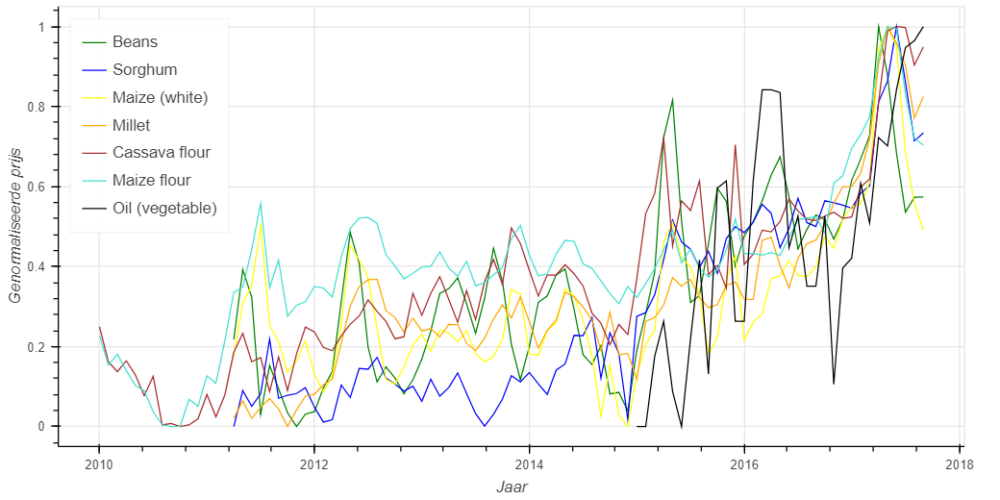

# Introductie
Dit onderzoek poogt patronen te zoeken in de prijsveranderingen van voedsel, specifiek in de regio’s Afrika en en het Midden-Oosten.  Hoofdzakelijk wordt er prijsverandering onderzocht onder invloed van nabij gelegen markten van verschillende landen.  Andere producten zijn hevig afhankelijk van klimato-
logische verschijnselen zoals temperatuur en regenval.  En lokale voedselprijzen hebben weer invloed op migratiestromen in een regio.
# Interactieve kaarten
Om de data weer te geven hebben we drie interactieve kaarten gemaakt. Een kaart die de voedselprijzen per land weergeeft, een kaart die de temperatuur per land weergeeft en een kaart die neerslag per land weergeeft.

<iframe src="github page/interactive_maps_pr_tas.html" scrolling="no" style="overflow:hidden;"></iframe>

<iframe src="github page/interactive_map.html" style="overflow:hidden;"></iframe>

# Resultaten

<iframe src="plotted comparisons/regression_plots/Sudan/Sudan_wheat.html" ></iframe>
## Gemiddelde prijzen

## Producten per land
<iframe id="chord" src="plotted comparisons/chord_charts/chord_chart_africa.html"></iframe>
<iframe id="chord" src="plotted comparisons/chord_charts/chord_chart_middle_east.html"

# Top 3 meest interessante bevindingen
