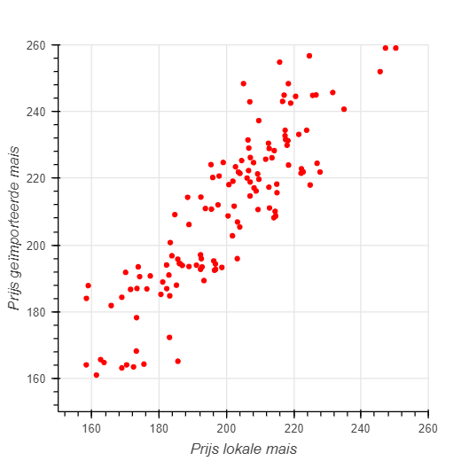
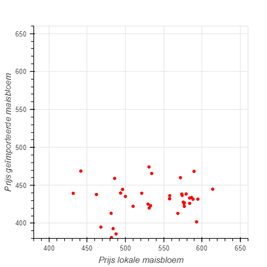
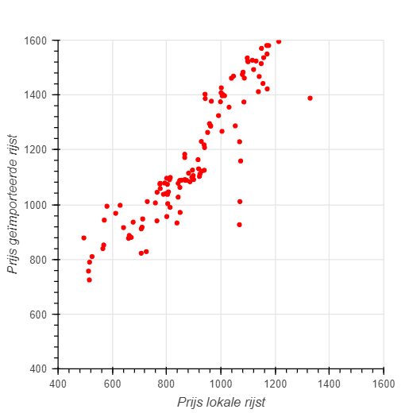
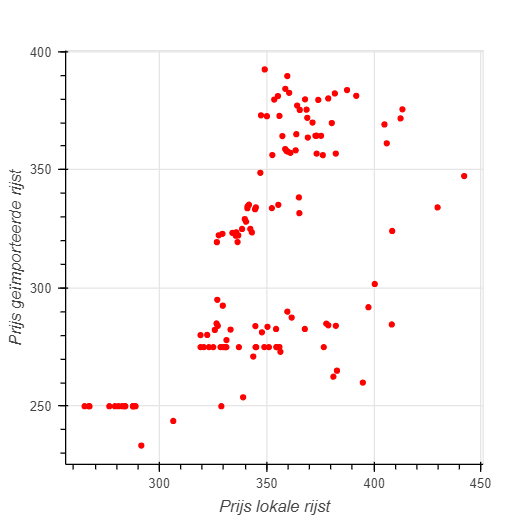
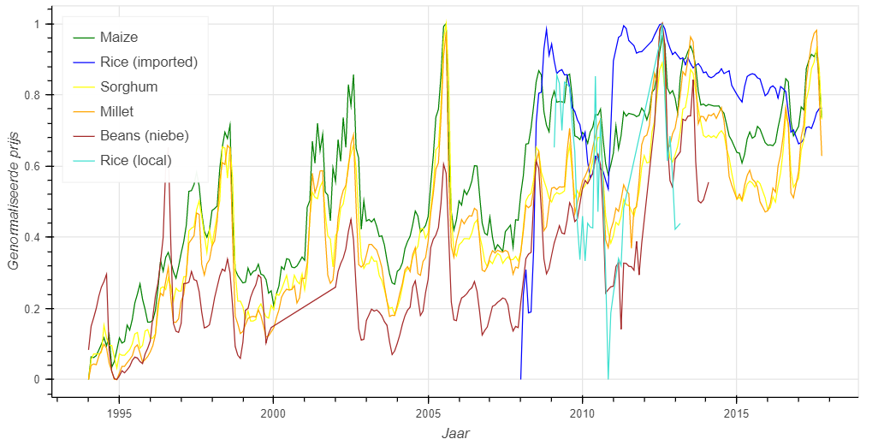
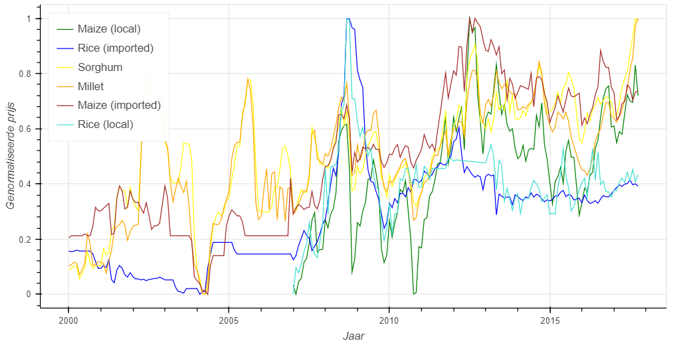
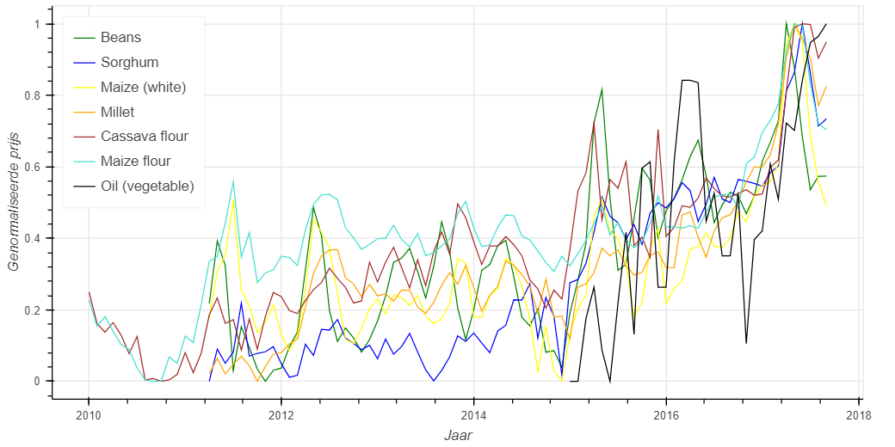
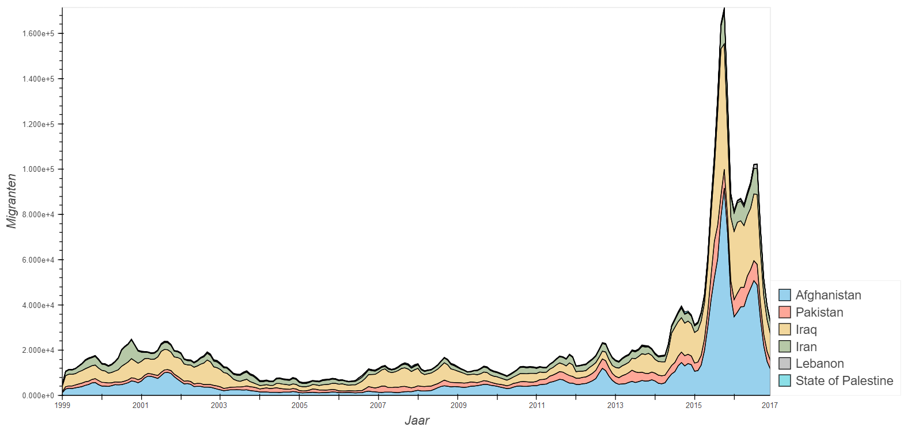
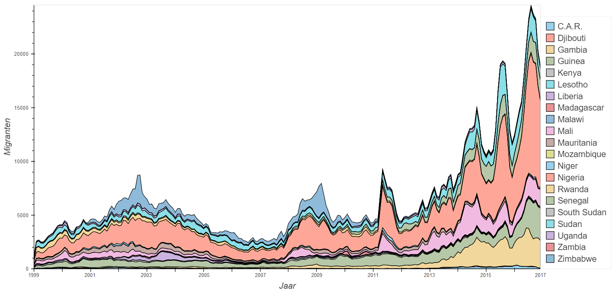

# Introductie
Dit onderzoek poogt patronen te zoeken in de prijsveranderingen van voedsel, specifiek in de regio’s Afrika en en het Midden-Oosten.  Hoofdzakelijk wordt er prijsverandering onderzocht onder invloed van nabij gelegen markten van verschillende landen.  Andere producten zijn hevig afhankelijk van klimato-
logische verschijnselen zoals temperatuur en regenval.  En lokale voedselprijzen hebben weer invloed op migratiestromen in een regio.

# Voedselprijzen per land

<iframe src="github page/interactive_map.html" style="overflow:hidden;" ></iframe>

# Resultaten

## Producten per land

Midden-Oosten

<iframe src="docs/chord_charts/chord_chart_middle_east.html" scrolling="no" style="overflow:hidden; height:825px"></iframe>

Afrika

<iframe src="docs/chord_charts/chord_chart_africa.html" scrolling="no" style="overflow:hidden; height:825px"></iframe>

# Top 3 meest interessante bevindingen
## Lokale- tegenover geïmporteerde producten
Senegal

Rwanda

Democratische republiek Congo

Mali

Je kan zien dat de prijs van lokale rijst een lineair verband heeft met de prijs van geïmporteerde rijst.

## Gemiddelde prijzen van producten in verschillende landen
Niger

Senegal

Uganda

## Migranten per land

Midden-Oosten

Afrika

## Temperatuur en neerslag

<iframe src="github page/interactive_maps_pr_tas.html" scrolling="no" style="overflow:hidden;"></iframe>

In de grafiek hieronder is te zien dat de hoge temperatuur heeft gezorgd voor een slechte oogst, waardoor de prijs steeg in 2013.

Hier kan je zien dat de prijs duidelijk afhankelijk is van de neerslag en temperatuur.

<iframe src="github page/slideshow_take.html" scrolling="no" style="height:700px; width:832px"></iframe>
